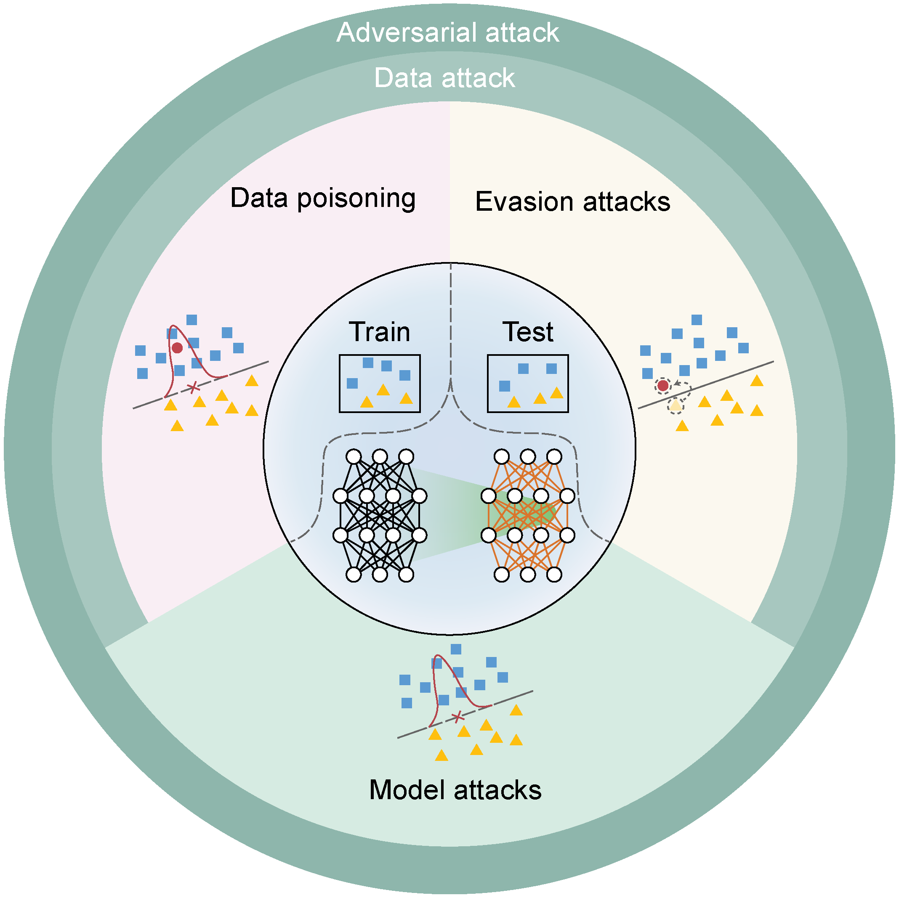

# Data Poisoning in Deep Learning: A Survey ☠️

> Data Poisoning in Deep Learning: A Survey
>
>
> 深度学习中的数据投毒：综述


<p align="center">
  
</p>
<p align="center"><b>📌 Fig. 1.</b> Types of Adversarial Attacks.</p>


💉This repository is a collection of resources on **data poisoning in deep learning**, serving as a supplement to our survey paper:  
📜 "[Data Poisoning in Deep Learning: A Survey](https://arxiv.org/abs/ )" 

If you have any recommendations for missing work or suggestions, please feel free to:  
✦ [Submit a pull request](https://github.com/YOUR_REPO/Data-Poisoning/pulls)  
✦ [Contact us](mailto:YOUR_EMAIL) ✉️  
We appreciate your contributions and feedback! 

## Table of Contents 📋
⭐️ [Taxonomy of Poisoning Attacks](#taxonomy-of-poisoning-attacks)  
　🔹 [Attack Objective](#attack-objective)  
　🔹 [Attack Goal](#attack-goal)  
　🔹 [Attack Knowledge](#attack-knowledge)  
　🔹 [Attack Scope](#attack-scope)  
　🔹 [Attack Impact](#attack-impact)  
　🔹 [Attack Variability](#attack-variability)  
 
⭐️ [DATA POISONING ALGORITHMS](#data-poisoning-algorithms)  
　🔹 [Heuristic-based Attacks](#heuristic-based-attacks)  
　🔹 [Label Flipping Attacks](#label-flipping-attacks)  
　🔹 [Feature Space Attacks](#feature-space-attacks)  
　🔹 [Bilevel Optimization Attacks](#bilevel-optimization-attacks)  
　🔹 [Influence-based Attacks](#influence-based-attacks)  
　🔹 [Generative Attacks](#generative-attacks)  
 
⭐️ [DATA POISONING IN LARGE LANGUAGE MODELS](#data-poisoning-in-large-language-models)  
　🔹 [Pre-training](#pre-training)  
　🔹 [Fine-tuning](#fine-tuning)  
　🔹 [Preference Alignment](#preference-alignment)  
　🔹 [Instruction Tuning](#instruction-tuning)  
　🔹 [Prefix Tuning](#prefix-tuning)  
　🔹 [In-Context Learning Phase](#in-context-learning-icl-phase)  
　🔹 [Prompt Injection](#prompt-injection) 


## TAXONOMY OF POISONING ATTACKS

### 🔷 Attack Objective
#### 🌿 Label Modification Attack
- **Efficient label contamination attacks against black-box learning models.**<br>
*Zhao, Mengchen and An, Bo and Gao, Wei and Zhang, Teng.*<br>
IJCAI `2023`. [[Paper](https://dl.acm.org/doi/abs/10.5555/3172077.3172440)] [[Data](https://www.csie.ntu.edu.tw/~cjlin/libsvmtools/datasets/)]
- **Data poisoning attack by label flipping on splitfed learning.**<br>
*Gajbhiye, Saurabh, Priyanka Singh, and Shaifu Gupta.*<br>
RTIP2R `2022`. [[Paper](https://link.springer.com/chapter/10.1007/978-3-031-23599-3_30)]
- **A label flipping attack on machine learning model and its defense mechanism.**<br>
*Li, Qingru and Wang, Xinru and Wang, Fangwei and Wang, Changguang.*<br>
ICA3PP `2022`. [[Paper](https://link.springer.com/chapter/10.1007/978-3-031-22677-9_26)]
- **Label poisoning is all you need.**<br>
*Jha, Rishi and Hayase, Jonathan and Oh, Sewoong.*<br>
NeurIPS `2023`. [[Paper](https://proceedings.neurips.cc/paper_files/paper/2023/hash/e0c9b65fb3e41aaa86576df3ec33ad2e-Abstract-Conference.html)]
- **A Backdoor Approach with Inverted Labels Using Dirty Label-Flipping Attacks.**<br>
*Mengara, Orson.*<br>
IEEE Access `2024`. [[Paper](https://ieeexplore.ieee.org/abstract/document/10483076/)] [[Code](https://github.com/Trusted-AI/adversarial-robustness-toolbox/pull/2376)] [[Data](https://www.kaggle.com/datasets/mfekadu/darpa-timit-acousticphonetic-continuous-speech)]

#### 🌿 Input Modification Attack
- **Poison frogs! targeted clean-label poisoning attacks on neural networks.**<br>
*Shafahi, Ali and Huang, W Ronny and Najibi, Mahyar and Suciu, Octavian and Studer, Christoph and Dumitras, Tudor and Goldstein, Tom.*<br>
NeurIPS  `2018`. [[Paper](https://proceedings.neurips.cc/paper_files/paper/2018/hash/22722a343513ed45f14905eb07621686-Abstract.html)] [[Code](https://github.com/ashafahi/inceptionv3-transferLearn-poison)]
- **When does machine learning {FAIL}? generalized transferability for evasion and poisoning attacks.**<br>
*Suciu, Octavian and Marginean, Radu and Kaya, Yigitcan and Daume III, Hal and Dumitras, Tudor.*<br>
USENIX Security `2018`. [[Paper](https://www.usenix.org/conference/usenixsecurity18/presentation/suciu)][[Code](https://githubcom/sdsatumd)]
- **Transferable clean-label poisoning attacks on deep neural nets.**<br>
*Zhu, Chen and Huang, W Ronny and Li, Hengduo and Taylor, Gavin and Studer, Christoph and Goldstein, Tom.*<br>
ICML `2019`. [[Paper](https://proceedings.mlr.press/v97/zhu19a.html)] [[Code](https://github.com/zhuchen03/ConvexPolytopePosioning.git)] [[Data](https://github.com/kuangliu/pytorch-cifar)]
- **Practical poisoning attacks on neural networks.**<br>
*Guo, Junfeng and Liu, Cong.*<br>
ECCV `2020`. [[Paper](https://link.springer.com/chapter/10.1007/978-3-030-58583-9_9)] 
- **Bullseye polytope: A scalable clean-label poisoning attack with improved transferability.**<br>
*Aghakhani, Hojjat and Meng, Dongyu and Wang, Yu-Xiang and Kruegel, Christopher and Vigna, Giovanni.*<br>
EuroS&P `2021`. [[Paper](https://ieeexplore.ieee.org/abstract/document/9581207/)] [[Code](github.com/ucsb-seclab/BullseyePoison.)]
- **Optimizing millions of hyperparameters by implicit differentiation.**<br>
*Lorraine, Jonathan and Vicol, Paul and Duvenaud, David.*<br>
AISTATS `2020`. [[Paper](https://proceedings.mlr.press/v108/lorraine20a.html)]
- **Witches' brew: Industrial scale data poisoning via gradient matching.**<br>
*Geiping, Jonas and Fowl, Liam and Huang, W Ronny and Czaja, Wojciech and Taylor, Gavin and Moeller, Michael and Goldstein, Tom.*<br>
arXiv `2020`. [[Paper](https://arxiv.org/abs/2009.02276)] [[Code](https://github.com/JonasGeiping/poisoning-gradient-matching)]
- **Metapoison: Practical general-purpose clean-label data poisoning.**<br>
*Huang, W Ronny and Geiping, Jonas and Fowl, Liam and Taylor, Gavin and Goldstein, Tom.*<br>
NeurIPS `2020`. [[Paper](https://proceedings.neurips.cc/paper/2020/hash/8ce6fc704072e351679ac97d4a985574-Abstract.html)] [[Code](https://wwwgithubcom/wronnyhuang/metapoison)]
- **Preventing unauthorized use of proprietary data: Poisoning for secure dataset release.**<br>
*Fowl, Liam and Chiang, Ping-yeh and Goldblum, Micah and Geiping, Jonas and Bansal, Arpit and Czaja, Wojtek and Goldstein, Tom.*<br>
arXiv `2021`. [[Paper](https://arxiv.org/abs/2103.02683)] [[Data](https://github.com/kuangliu/pytorch-cifar)]


#### 🌿 Data Modification Attack
- **Badnets: Identifying vulnerabilities in the machine learning model supply chain.**<br>
*Gu, Tianyu and Dolan-Gavitt, Brendan and Garg, Siddharth.*<br>
arXiv `2017`. [[Paper](https://arxiv.org/abs/1708.06733)]
- **Trojaning attack on neural networks.**<br>
*Liu, Yingqi and Ma, Shiqing and Aafer, Yousra and Lee, Wen-Chuan and Zhai, Juan and Wang, Weihang and Zhang, Xiangyu.*<br>
NDSS `2018`. [[Paper](https://scholarship.libraries.rutgers.edu/esploro/outputs/conferencePaper/Trojaning-attack-on-neural-networks/991031794682704646)]
- **Facehack: Triggering backdoored facial recognition systems using facial characteristics.**<br>
*Sarkar, Esha and Benkraouda, Hadjer and Maniatakos, Michail.*<br>
arXiv `2020`. [[Paper](https://arxiv.org/abs/2006.11623)]
- **Backdoor embedding in convolutional neural network models via invisible perturbation.**<br>
*Zhong, Haoti and Liao, Cong and Squicciarini, Anna Cinzia and Zhu, Sencun and Miller, David.*<br>
CODASPY `2020`. [[Paper](https://dl.acm.org/doi/abs/10.1145/3374664.3375751)]
- **Input-aware dynamic backdoor attack.**<br>
*Nguyen, Tuan Anh and Tran, Anh.*<br>
NeurIPS `2020`. [[Paper](https://proceedings.neurips.cc/paper/2020/hash/234e691320c0ad5b45ee3c96d0d7b8f8-Abstract.html)]
- **Lira: Learnable, imperceptible and robust backdoor attacks.**<br>
*Doan, Khoa and Lao, Yingjie and Zhao, Weijie and Li, Ping.*<br>
ICCV `2021`. [[Paper](https://openaccess.thecvf.com/content/ICCV2021/html/Doan_LIRA_Learnable_Imperceptible_and_Robust_Backdoor_Attacks_ICCV_2021_paper.html)]
- **Invisible backdoor attack with sample-specific triggers.**<br>
*Li, Yuezun and Li, Yiming and Wu, Baoyuan and Li, Longkang and He, Ran and Lyu, Siwei.*<br>
ICCV `2021`. [[Paper](https://openaccess.thecvf.com/content/ICCV2021/html/Li_Invisible_Backdoor_Attack_With_Sample-Specific_Triggers_ICCV_2021_paper.html)] [[Code](https://github.com/yuezunli/ISSBA)]


### 🔷 Attack Goal
#### 🌿 Untargeted Attack
- **Preventing unauthorized use of proprietary data: Poisoning for secure dataset release.**<br>
*Fowl, Liam and Chiang, Ping-yeh and Goldblum, Micah and Geiping, Jonas and Bansal, Arpit and Czaja, Wojtek and Goldstein, Tom.*<br>
arXiv `2021`. [[Paper](https://arxiv.org/abs/2103.02683)] [[Data](https://github.com/kuangliu/pytorch-cifar)]
- **Towards poisoning of deep learning algorithms with back-gradient optimization.**<br>
*Muñoz-González, Luis and Biggio, Battista and Demontis, Ambra and Paudice, Andrea and Wongrassamee, Vasin and Lupu, Emil C and Roli, Fabio.*<br>
AISec `2017`. [[Paper](https://dl.acm.org/doi/abs/10.1145/3128572.3140451)] [[Data](https://github.com/tflearn/tflearn/blob/master/examples/images/convnet_mnist.py)]
- **Generative poisoning attack method against neural networks.**<br>
*Yang, Chaofei and Wu, Qing and Li, Hai and Chen, Yiran.*<br>
arXiv `2017`. [[Paper](https://arxiv.org/abs/1703.01340)]
- **Learning to confuse: Generating training time adversarial data with auto-encoder.**<br>
*Feng, Ji and Cai, Qi-Zhi and Zhou, Zhi-Hua.*<br>
NeurIPS `2019`. [[Paper](https://proceedings.neurips.cc/paper_files/paper/2019/hash/1ce83e5d4135b07c0b82afffbe2b3436-Abstract.html)]
- **Poisoning attacks with generative adversarial nets.**<br>
*Muñoz-González, Luis and Pfitzner, Bjarne and Russo, Matteo and Carnerero-Cano, Javier and Lupu, Emil C.*<br>
arXiv `2019`. [[Paper](https://arxiv.org/abs/1906.07773)]

#### 🌿 Targeted Attack
- **Poison frogs! targeted clean-label poisoning attacks on neural networks.**<br>
*Shafahi, Ali and Huang, W Ronny and Najibi, Mahyar and Suciu, Octavian and Studer, Christoph and Dumitras, Tudor and Goldstein, Tom.*<br>
NeurIPS  `2018`. [[Paper](https://proceedings.neurips.cc/paper_files/paper/2018/hash/22722a343513ed45f14905eb07621686-Abstract.html)] [[Code](https://github.com/ashafahi/inceptionv3-transferLearn-poison)]
- **Practical poisoning attacks on neural networks.**<br>
*Guo, Junfeng and Liu, Cong.*<br>
ECCV `2020`. [[Paper](https://link.springer.com/chapter/10.1007/978-3-030-58583-9_9)] 
- **Bullseye polytope: A scalable clean-label poisoning attack with improved transferability.**<br>
*Aghakhani, Hojjat and Meng, Dongyu and Wang, Yu-Xiang and Kruegel, Christopher and Vigna, Giovanni.*<br>
EuroS&P `2021`. [[Paper](https://ieeexplore.ieee.org/abstract/document/9581207/)] [[Code](github.com/ucsb-seclab/BullseyePoison.)]
- **Influence function based data poisoning attacks to top-n recommender systems.**<br>
*Fang, Minghong and Gong, Neil Zhenqiang and Liu, Jia.*<br>
WWW `2020`. [[Paper](https://dl.acm.org/doi/abs/10.1145/3366423.3380072)]
- **Subpopulation data poisoning attacks.**<br>
*Jagielski, Matthew and Severi, Giorgio and Pousette Harger, Niklas and Oprea, Alina.*<br>
CCS `2021`. [[Paper](https://dl.acm.org/doi/abs/10.1145/3460120.3485368)]

#### 🌿 Backdoor Attack
- **Badnets: Identifying vulnerabilities in the machine learning model supply chain.**<br>
*Gu, Tianyu and Dolan-Gavitt, Brendan and Garg, Siddharth.*<br>
arXiv `2017`. [[Paper](https://arxiv.org/abs/1708.06733)]
- **Targeted backdoor attacks on deep learning systems using data poisoning.**<br>
*Chen, Xinyun and Liu, Chang and Li, Bo and Lu, Kimberly and Song, Dawn.*<br>
arXiv `2017`. [[Paper](https://arxiv.org/pdf/1712.05526)] [[Data](https://github.com/jinze1994/DeepID)]
- **Label-consistent backdoor attacks.**<br>
*Turner, Alexander and Tsipras, Dimitris and Madry, Aleksander.*<br>
arXiv `2019`. [[Paper](https://arxiv.org/abs/1912.02771)] [[Data](https://github.com/MadryLab/cifar10_challenge)]
- **Data poisoning and backdoor attacks on audio intelligence systems.**<br>
*Ge, Yunjie and Wang, Qian and Yu, Jiayuan and Shen, Chao and Li, Q.*<br>
 `2023`. [[Paper](https://ieeexplore.ieee.org/abstract/document/10082866/)]
- **Data Poisoning based Backdoor Attacks to Contrastive Learning.**<br>
*Zhang, Jinghuai and Liu, Hongbin and Jia, Jinyuan and Gong, Neil Zhenqiang.*<br>
CVPR `2024`. [[Paper](https://openaccess.thecvf.com/content/CVPR2024/html/Zhang_Data_Poisoning_based_Backdoor_Attacks_to_Contrastive_Learning_CVPR_2024_paper.html)] [[Code](https://github.com/jzhang538/CorruptEncoder)]


### 🔷 Attack Knowledge
#### 🌿 White-box Attack
- **Poison frogs! targeted clean-label poisoning attacks on neural networks.**<br>
*Shafahi, Ali and Huang, W Ronny and Najibi, Mahyar and Suciu, Octavian and Studer, Christoph and Dumitras, Tudor and Goldstein, Tom.*<br>
NeurIPS  `2018`. [[Paper](https://proceedings.neurips.cc/paper_files/paper/2018/hash/22722a343513ed45f14905eb07621686-Abstract.html)] [[Code](https://github.com/ashafahi/inceptionv3-transferLearn-poison)]
- **Learning to confuse: Generating training time adversarial data with auto-encoder.**<br>
*Feng, Ji and Cai, Qi-Zhi and Zhou, Zhi-Hua.*<br>
NeurIPS `2019`. [[Paper](https://proceedings.neurips.cc/paper_files/paper/2019/hash/1ce83e5d4135b07c0b82afffbe2b3436-Abstract.html)]
- **Poisoning attack in federated learning using generative adversarial nets.**<br>
*Zhang, Jiale and Chen, Junjun and Wu, Di and Chen, Bing and Yu, Shui.*<br>
TrustCom `2019`. [[Paper](https://ieeexplore.ieee.org/abstract/document/8887357)]
- **Stronger data poisoning attacks break data sanitization defenses.**<br>
*Koh, Pang Wei and Steinhardt, Jacob and Liang, Percy.*<br>
 Machine Learning `2022`. [[Paper](https://link.springer.com/article/10.1007/s10994-021-06119-y)] [[Code](https://github.com/kohpangwei/data-poisoning-journal-release)] [[Data](https://github.com/kohpangwei/data-poisoning-journal-release)]


#### 🌿 Black-box Attack
- **Zoo: Zeroth order optimization based black-box attacks to deep neural networks without training substitute models.**<br>
*Chen, Pin-Yu and Zhang, Huan and Sharma, Yash and Yi, Jinfeng and Hsieh, Cho-Jui.*<br>
AISec  `2017`. [[Paper](https://dl.acm.org/doi/abs/10.1145/3128572.3140448)] [[Code](https://github.com/huanzhang12/ZOO-Attack)] [[Data](https://github.com/carlini/nn_robust_attacks)]
- **Poisonous label attack: black-box data poisoning attack with enhanced conditional DCGAN.**<br>
*Liu, Haiqing and Li, Daoxing and Li, Yuancheng.*<br>
 Neural Processing Letters `2021`. [[Paper](https://link.springer.com/article/10.1007/s11063-021-10584-w)]
- **Black-Box Data Poisoning Attacks on Crowdsourcing.**<br>
*Chen, Pengpeng and Yang, Yongqiang and Yang, Dingqi and Sun, Hailong and Chen, Zhijun and Lin, Peng.*<br>
IJCAI  `2023`. [[Paper](https://www.ijcai.org/proceedings/2023/0332.pdf)] [[Code](https://github.com/yongqiangyang/SubPac)]
- **Poisonrec: an adaptive data poisoning framework for attacking black-box recommender systems.**<br>
*Song, Junshuai and Li, Zhao and Hu, Zehong and Wu, Yucheng and Li, Zhenpeng and Li, Jian and Gao, Jun.*<br>
ICDE `2020`. [[Paper](https://ieeexplore.ieee.org/abstract/document/9101655/)] [[Data1](https://www.kaggle.com/tamber/steam-video-games/)][[Data2](https://grouplens.org/datasets/movielens/)][[Data3](http://jmcauley.ucsd.edu/data/amazon/)]
- **Reverse attack: Black-box attacks on collaborative recommendation.**<br>
*Zhang, Yihe and Yuan, Xu and Li, Jin and Lou, Jiadong and Chen, Li and Tzeng, Nian-Feng.*<br>
CCS  `2021`. [[Paper](https://dl.acm.org/doi/abs/10.1145/3460120.3484805)]


#### 🌿 Gray-box Attack
- **Local model poisoning attacks to {Byzantine-Robust} federated learning.**<br>
*Fang, Minghong and Cao, Xiaoyu and Jia, Jinyuan and Gong, Neil.*<br>
USENIX Security `2020`. [[Paper](https://dl.acm.org/doi/abs/10.1145/3460120.3484805)] [[Data](https://www.kaggle.com/kmader/colorectal-histology-mnist#hmnist_64_64_L.csv)]
- **Analyzing federated learning through an adversarial lens.**<br>
*Bhagoji, Arjun Nitin and Chakraborty, Supriyo and Mittal, Prateek and Calo, Seraphin.*<br>
 ICML `2019`. [[Paper](https://proceedings.mlr.press/v97/bhagoji19a.html)] [[Code](https://github.com/inspire-group/ModelPoisoning)] [[Data](https://archive.ics.uci.edu/ml/datasets/adult)]
- **You autocomplete me: Poisoning vulnerabilities in neural code completion.**<br>
*Schuster, Roei and Song, Congzheng and Tromer, Eran and Shmatikov, Vitaly.*<br>
USENIX Security `2021`. [[Paper](https://www.usenix.org/conference/usenixsecurity21/presentation/schuster)]
- **Towards Effective Data Poisoning for Imbalanced Classification.**<br>
*Mishra, Snigdha Sushil and He, Hao and Wang, Hao.*<br>
ICML  `2023`. [[Paper](https://openreview.net/forum?id=k7xYHWG21O)] [[Code](https://github.com/snigdhas-mishra/Data_Poisoning_Imbalanced_Classifiers)]


### 🔷 Attack Stealthiness
#### 🌿 Non-stealthy Attack
- **.**<br>
*.*<br>
  `2000`. [[Paper]()]

#### 🌿 Stealthy Attack
- **.**<br>
*.*<br>
  `2000`. [[Paper]()]


### 🔷 Attack Scope
#### 🌿 Single-Instance Attack
- **.**<br>
*.*<br>
  `2000`. [[Paper]()]
- **.**<br>
*.*<br>
  `2000`. [[Paper]()]

#### 🌿 Single-pattern Attack
#### 🌿 Single-class Attack
#### 🌿 Broad-scope Attack

### 🔷 Attack Impact
#### 🌿 Performance Attack
#### 🌿 Robustness Attack
#### 🌿 Fairness Attack

### 🔷 Attack Variability
#### 🌿 Static Attack
#### 🌿 Dynamic Attack


## TAXONOMY OF POISONING ALGORITHMS

### 🔷 Heuristic-based Attacks
### 🔷 Label Flipping Attacks
### 🔷 Feature Space Attacks
### 🔷 Bilevel Optimization Attacks
### 🔷 Influence-based Attacks
### 🔷 Generative Attacks


## DATA POISONING IN LARGE LANGUAGE MODELS

### 🔷 Pre-training
### 🔷 Fine-tuning
### 🔷 Preference Alignment
### 🔷 Instruction Tuning
### 🔷 Prefix Tuning
### 🔷 In-Context Learning
### 🔷 Prompt Injection


## Citation 📖 
The manuscript is avaliable in arXiv:
```sh
"Data Poisoning in Deep Learning: A Survey". arXiv preprint arXiv: [pdf]
```
